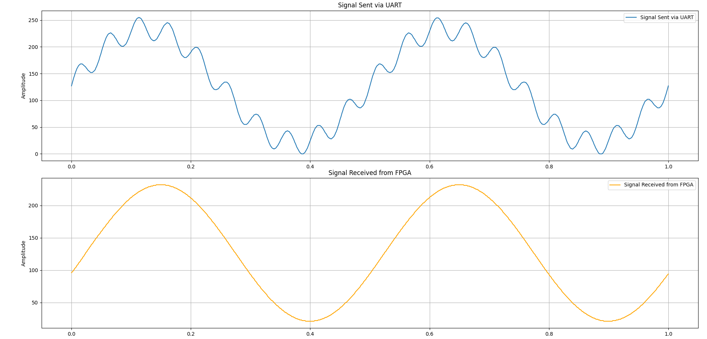
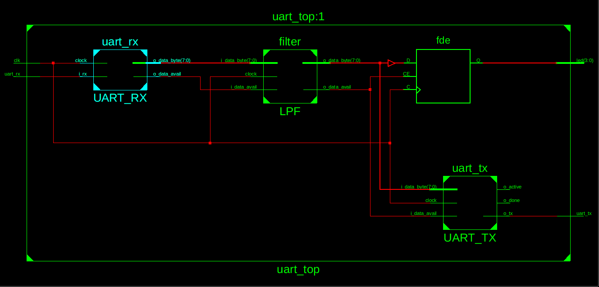

# UART on FPGA
Implementation of the UART protocol written in Verilog.

This is a very simple implementation of the Universal Asynchronous Receiver Transmitter (UART) protocol written in Verilog and can be synthesised to be used on an FPGA. I've tested it on the *Xilinx Spartan SP601 evaluation board*  using Xilinx ISE 14.7. 

I've also included a demo project: a 50 tap moving average filter that receives and sends the sine wave samples over UART to and fro from the FPGA board. A python script to establish serial communication  between the FPGA board and your computer is also included (make sure to change the serial port).

### Directory Strcuture

|folder  | content  |
|--|--|
| assets  | plot images etc. |
| constraints | The constraint file for Xilinx S6 SP601|
|hdl | Verilog sources for UART implementation |
| filter | A demo project that contains Verilog sources for a moving average filter communicating over UART|
| serial. py | Python script for serial commnuication  |

### Result from the moving average filter

### RTL schematic

